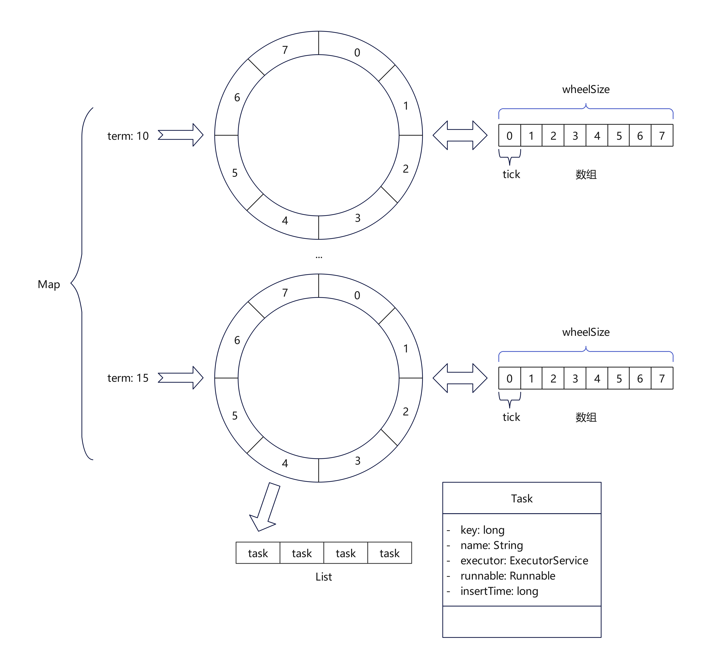

# gill-timewheel
时间轮盘调度器，统一管理延时任务

## 使用场景

在项目中经常需要使用内存级别的延时任务来完成业务上的处理，如通过延迟双删来达到缓存与数据库的数据一致性。

## 结构设计

`TimeWheel`中使用`Map`来进行时间轮盘的存储，`map.key`代表时间轮盘的任期，`map.value`代表一个时间轮盘。

一个轮盘的周期 = `wheelSize` * `tick`

`wheelSize`表示轮盘分割的次数。`tick`表示时间轮盘的任务调度的最小单位。

